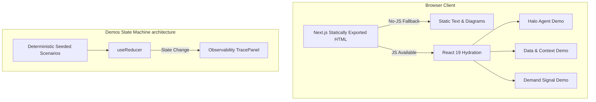

# DAXVORA Website — Architecture View

This document satisfies PRD §7.2, providing a high-level view of how the site and its three interactive demos are constructed.

## 1. System Overview

The DAXVORA website is built as a static site using Next.js 15 App Router. It is designed to be highly performant, resilient to network/JS failures, and completely self-contained. 

There is **no backend, no database, and no live API integrations.**

## 2. Component Architecture

### Content Pages (Server Components)
All content pages (`/`, `/method`, `/services`, `/halo-agent`, `/operating-domains`, `/about`, `/contact`) are statically rendered HTML. They require zero JavaScript to display content, ensuring compliance with the "No-JS" and "Slow Network" requirements.

### Interactive Demos (Client Components)
The three demos are implemented as isolated React Client Components (`"use client"`). They follow a strict unidirectional data flow using `useReducer`.

1. **State:** Held entirely in browser memory. Reloading the page resets all demo state.
2. **Inputs:** Sourced exclusively from hardcoded `fixtures.ts` files. No user free-text input is accepted, ensuring deterministic testing.
3. **Execution:** Transitions between states (e.g., `validating` -> `scoring` -> `routed`) are triggered by pure reducer functions.
4. **Observability:** Every state transition dispatches an event to the shared `<TracePanel>`, logging the decision, action, result, and latency.

## 3. Demo Data Flows & Failure Paths

### Halo Agent Demo (`/halo-agent`)
- **Agents Simulated:** Router/Qualifier, Revenue Ops Specialist, Demand Gen Specialist.
- **Flow:** `Select Persona` -> `Route Decision` (evaluates persona and routes to appropriate specialist or human escalation).
- **Failure Path:** Clicking "Simulate provider failure" transitions state to `route_failed`, rendering an explicit error UI (`role="alert"`). Context is preserved.

### Data & Context Foundation Demo (`/method`)
- **Agents Simulated:** Data Normalization Pipeline, Governance Check.
- **Flow:** `Select Scenario` -> `Confirm Governance` -> `Decide Action` -> `Action Taken`.
- **Failure Path:** Clicking "Simulate source failure" transitions state to `source_failed`. Simulates an upstream data source going offline.

### Demand-to-Revenue Demo (`/services`)
- **Agents Simulated:** Signal Validator, Classifier, Scoring Engine, Routing Engine.
- **Flow:** `Select Signal` -> `Validate` -> `Classify` -> `Score` -> `Attribute` -> `Route` -> `Receipt`.
- **Failure Path 1:** Submitting the "Missing Email" fixture fails validation and transitions directly to `signal_rejected`.
- **Failure Path 2:** Clicking "Simulate pipeline failure" at any intermediate step transitions to `pipeline_failed`.

## 4. Hosting & Deployment Constraints

- **Export:** Configured for `output: "export"`.
- **Hosting:** Can be hosted on any static file server (Vercel, AWS S3, GitHub Pages).
- **Cost:** Expected hosting cost is $0 on any modern static hosting free tier.
- **Forms:** The contact form on `/contact` degrades to a native `mailto:` link utilizing the user's local email client, ensuring zero backend infrastructure or paid API dependencies are required.
